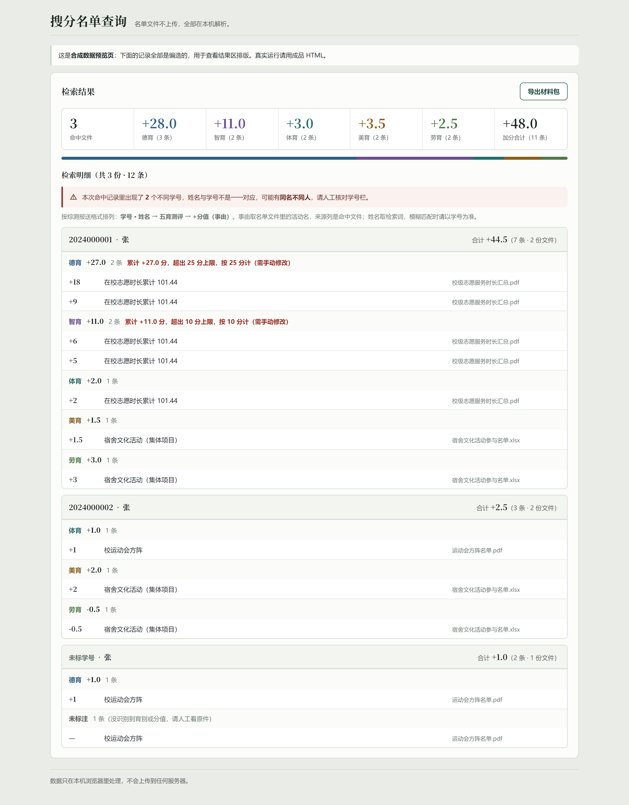

# 搜分名单查询工具

> 把一堆格式各异的「加分名单」文件，变成一张可报送的综测加分清单。
> **纯本地运行，名单文件不上传任何服务器。**

输入一个装着 zip / PDF / Excel 名单的文件夹（或直接拖文件），输入姓名，工具会告诉你：
这个人加了哪些分、加在哪一育、出自哪份文件，并可直接导出 **Excel 汇总表** 和
**按报送目录结构打包的加分证明材料**。

面向场景：高校班级综测加分核对与材料整理。当前规则口径取自
《福建农林大学金山学院学生综合素质测评管理规定》（闽农大金山学〔2025〕26 号），
规则集中在一处（见 [五育口径](#五育口径)），换成别的学校只需改上限表。

---

## 目录

- [为什么做它](#为什么做它)
- [特性](#特性)
- [快速开始](#快速开始)
- [结果长什么样](#结果长什么样)
- [五育口径](#五育口径)
- [材料包目录结构](#材料包目录结构)
- [仓库结构](#仓库结构)
- [构建与校验](#构建与校验)
- [隐私设计](#隐私设计)
- [常见问题](#常见问题)
- [许可](#许可)

---

## 为什么做它

班级综测加分材料通常是几十份 PDF，分散在 zip 里，还夹杂 Excel 和扫描件。核对一个人加了多少分，
要一份份翻、一页页找，既慢又容易漏。而这个活儿又**不能**拿去用在线服务——名单里有真实姓名和学号。

所以做了这个工具：**一个 HTML 文件，双击就能用，全程在本机浏览器里跑。**

## 特性

| 能力 | 说明 |
|---|---|
| 单文件离线 | 一个 HTML 装下全部引擎与模型，双击即用；无后端、无网络请求、无安装 |
| 多格式解析 | zip（含嵌套目录）、PDF（文本层直接读）、扫描件 PDF（OCR）、xlsx / xlsm、txt / csv |
| 双 OCR 引擎 | 内置 PP-OCRv4 移动端 WebGPU 引擎；GPU 不可用时自动回退 Tesseract.js |
| 五育归集 | 按 德育 / 智育 / 体育 / 美育 / 劳育 分列汇总，自动套用规定上限并标注「超出上限」 |
| 智能去重 | 同一活动被归档到多个目录时，按「活动 + 加分值 + 学号」识别重复副本，各保留一份 |
| 同名提醒 | 命中多个学号时提示「姓名与学号非一一对应」，避免同名不同人算错 |
| 导出 Excel | 两个工作表：`加分证明清单`（逐条）与 `五育汇总`（逐人） |
| 导出材料包 | 按 `学号姓名/五育测评/+分值 (事由)` 目录结构打包命中名单原件，可直接交班长 |
| 解析缓存 | 解析过的文件文本存 IndexedDB，重复查询不重复 OCR |
| 可中断 | 长任务有进度条、百分比、已用与预计剩余时间 |

## 快速开始

### 给使用者：直接用成品

1. 打开 [Releases](../../releases) 页，下载附件 `score-ocr-tool.zip`（约 28 MB，**唯一的附件**）
2. 解压到一个空文件夹——里面是成品 HTML 和启动器 `打开工具.cmd`
3. 双击 `打开工具.cmd`（也可以直接双击 HTML，见下）
4. 把名单文件（或整个 zip）拖进页面 → 输入姓名 → 点「开始解析」

> 成品体积大是因为 OCR 模型与全部第三方库都内嵌在文件里——这正是它离线可用的原因。
> `打开工具.cmd` 只替你做一件事：用 `--force_high_performance_gpu` 启动 Chrome / Edge，
> 让 WebGPU 走独立显卡（双显卡笔记本上浏览器默认往往挑核显）。它不起服务、不驻留后台进程。
>
> 直接双击 HTML 同样能用：`file://` 下 pdf.js worker、Tesseract 回退、IndexedDB 缓存、
> Excel / 材料包导出都已实测可用（同一份扫描件、同一引擎对照：`file://` 识别 37.3s、
> `http://` 识别 39.7s，均 0 条错误），差别只在浏览器会自选 GPU。

校验下载是否完整：

```powershell
# 解压后对 HTML 校验，期望 sha256（v2.11）
55ad8f466eaa62d45d0e3446bb6b4b2617f387e0a87167ade879ec8e8d3c6db8
```

### 给开发者：从源码构建

成品由 `.tools/build.py` **确定性生成**——同样的输入必然得到同样的 sha256。

```bash
# 源码与构建资产都已随仓库提供（clone 下来即可构建，无需联网）：
python .tools/build.py
# 输出: 搜分名单查询工具.html
```

构建脚本只做一件事：**按固定顺序拼接**。

| 输入 | 位置 |
|---|---|
| 模板 | `.tools/src/template.html`（约 1 KB 骨架，含 9 个槽位占位符） |
| 应用源码 | `.tools/src/app/*.js`（16 个模块，按 `SOURCES` 清单顺序拼接） |
| 界面样式 / 标记 | `.tools/src/style.css`、`.tools/src/body.html` |
| 构建资产 | `.tools/assets/*`（pdf.js / JSZip / Tesseract / onnxruntime-web + OCR 模型） |

没有「查找旧文本再替换」的锚点补丁：**改哪个功能就编辑哪个模块文件**，构建脚本不用动。
**永远不要手工编辑那个 44 MB 的 HTML。**

## 结果长什么样



打开 `.tools/demo/ui_demo.html` 可以看到同一界面（合成数据，不含真实名单）：

```bash
python -m http.server 18010 --bind 127.0.0.1
# 浏览器访问 http://127.0.0.1:18010/.tools/demo/ui_demo.html
python .tools/shot_demo.py        # 重新出图（需 Playwright）
```

结果区分三块：

1. **台账**——命中文件数、各育小计与条数、加分合计；缺项的育会明确点名
2. **提醒**——出现多个学号时提示人工核对
3. **检索明细**——按 `学号 · 姓名 → 五育测评 → +分值（事由）` 组织，超上限的那一育直接标注

## 五育口径

| 育别 | 上限处理 | 依据 |
|---|---|---|
| 德育 | 奖励分超出 **25 分按 25 分计**，界面标注「需手动修改」 | 规定第九条 |
| 智育 | 同一学年奖励分累计 **不超过 10 分** | 规定第十三条（五） |
| 体育 / 美育 / 劳育 | 不在此汇总设上限，按单项规定执行 | — |

五育顺序固定为 **德 → 智 → 体 → 美 → 劳**，与报送表一致。
上限表在 `.tools/src/app/85-render.js` 的 `YU_CAP` 里，换学校改这一处即可。

## 材料包目录结构

导出的 zip 与学校要求的报送结构一致：

```
2024级计科（专）1班/
├── 2024000001张三/
│   ├── 德育测评/
│   │   ├── +10 (在校志愿时长累计101.44).pdf
│   │   └── +1 (11月29日"学生一站式"周末音乐节).pdf
│   ├── 智育测评/
│   ├── 体育测评/
│   ├── 美育测评/
│   ├── 劳育测评/
│   └── 未识别/              ← 没识别到育别或分值的原件，留待人工核对
└── 2024000002李四/
    └── ...
```

命名规则：**原文件名保持不变，只在最前面加分值**——`+2 晚归打卡公示汇总.pdf`；
没识别到分值的加 `未识别分值 ` 前缀。目录名与文件名会做非法字符清理，超长名截断但保留扩展名。

> 导出前会估算体积，超过 300 MB 上限会直接提示而不再打包，避免浏览器卡死。

## 仓库结构

```
├── 打开工具.cmd                 # 唯一的启动器（强制独显打开）
├── docs/截图/                   # README 用图（合成数据）
└── .tools/                      # 源码、构建输入与校验脚本（见 .tools/README.md）
    ├── build.py                 # 唯一构建入口（纯字节拼接）
    ├── src/template.html        # 约 1KB 骨架，9 个槽位
    ├── src/app/*.js             # 应用源码，16 个模块（含 render / 导出 / 材料包）
    ├── src/style.css  body.html # 界面样式与标记
    ├── assets/                  # 构建资产：第三方库 + OCR 模型（约 42MB）
    ├── demo/ui_demo.html        # 合成数据 UI 预览
    └── ui_*.py / render_unit.js # 校验脚本

成品 HTML（约 44 MB）是构建输出，不随仓库分发，见 [Releases](../../releases)。
```

真实名单语料（`target/`、`.samples/`）、运行截图与历史交付物已在 `.gitignore` 中排除，
**不会进入仓库**。

## 构建与校验

| 检查 | 命令 | 期望 |
|---|---|---|
| 语法 | `python .tools/syntax_check.py` | 通过 |
| 静态结构 | `python .tools/ui_static_check.py` | 38/38 |
| 渲染单测 | `node .tools/render_unit.js` | 27/27，退出码 0 |
| 配色对比度 | `python .tools/ui_contrast.py` | 25/25（WCAG AA） |
| 无障碍 | `python .tools/ui_a11y.py` | 11/11 |
| 进度条一致性 | `python .tools/ui_barsync.py` | 12/37/63/85/100 逐帧一致 |
| 隐私门禁 | `python .tools/publish_check.py` | PASS（0 命中） |
| 成品隐私 | `python .tools/ui_pii_check.py` | PASS |
| 启动器编码 | `python .tools/launcher_check.py` | 失败项 0 |

带浏览器实跑的脚本需要先起一个静态服务（`python -m http.server 18010 --bind 127.0.0.1`），
并需要自备语料放在 `target/`。

## 隐私设计

这是本工具存在的前提，也是代码里被反复验证的部分：

- **不联网**：页面没有任何外部请求，OCR 模型与库全部内嵌
- **不上传**：文件只经过浏览器 `FileReader` / `ArrayBuffer`，不经过任何服务器
- **不落盘**：除 IndexedDB 的解析文本缓存外不写任何文件；缓存可随时清空
- **交付物自检**：`.tools/ui_pii_check.py` 用真实语料抽取姓名/学号真值，
  对成品做滑动窗口比对，确保 44MB 文件里不含任何真实姓名或学号
- **发布门禁**：`.tools/publish_check.py` 扫描**将要提交的文件**，拦截真实姓名、学号、
  本机绝对路径、邮箱、手机号、身份证号

> 本仓库的截图与示例数据**全部为合成**。真实名单截图含姓名学号，不能公开，因此以
> 文本图示与合成数据预览页代替。

## 常见问题

**Q：为什么成品有 44 MB？**
A：OCR 模型（检测 + 识别）、ORT 运行时、pdf.js、Tesseract.js、JSZip 全部内嵌在同一个文件里，
这是「单文件离线可用」的代价。构建产物走 Releases 附件，不进 git 历史。

**Q：`.tools/assets/` 里的 42 MB 是什么？**
A：**构建资产，不是成品**——4 个第三方库（pdf.js / JSZip / Tesseract.js / onnxruntime-web）
与 2 个 OCR 模型数据块。`build.py` 把它们按槽位拼进模板，产出成品。
它们随仓库提供，clone 下来即可构建，无需联网下载。

**Q：换一个学校能用吗？**
A：可以。五育上限集中在 `.tools/src/app/85-render.js` 的 `YU_CAP`，育别顺序在同文件的 `YU`，
材料包目录名在 `.tools/src/app/95-material.js` 的 `YU_DIR`，改完重新构建即可。

**Q：扫描件识别慢？**
A：勾选「识别扫描件」后走 OCR，速度取决于页数；GPU 可用时用 WebGPU 引擎，不可用时回退
Tesseract.js 会明显变慢。解析结果会缓存，同一批文件第二次查询很快。

## 许可

[MIT](LICENSE) © 2026 Bonger34

工具本身与代码以 MIT 许可开放。使用者需自行确保对所处理名单数据拥有合法处理权限。
